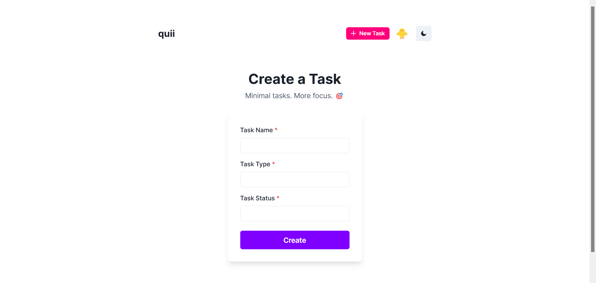

# Preview

Table of contents:
- [Home](#home)
- [Login](#login)
- [Register](#register)
- [New Account Creation](#new-account-creation)
- [404](#404)
- [Projects](#projects)
- [Projects (Dark theme)](#projects-dark-theme)
- [Create Project](#create-project)
- [New Project Creation](#new-project-creation)
- [Tasks](#tasks)
- [Create Task](#create-task)
- [New Task Creation](#new-task-creation)
- [Get Task](#get-task)

#### Home:

#### Login:

#### Register:

#### New Account Creation:

#### 404:

#### Projects:

#### Projects (Dark theme):

#### Create Project:

#### New Project Creation:

#### Tasks:

#### Create Task:

#### New Task Creation:

#### Get Task:

