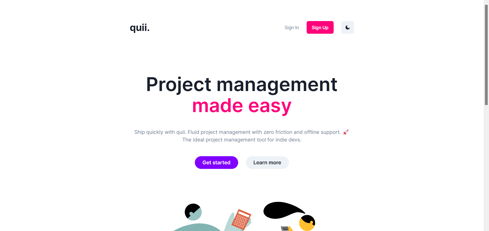
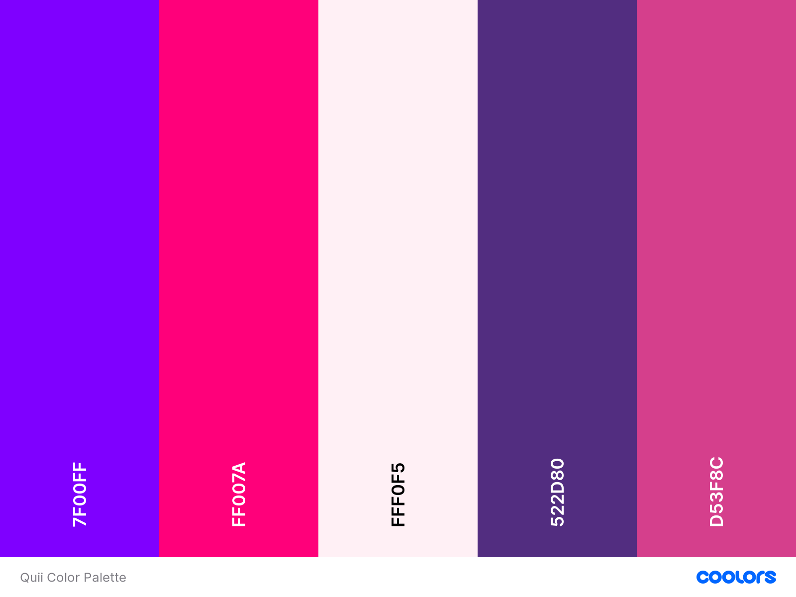

### Table of Contents

| [What is Quii?](#what-is-quii) | [Preview](#preview) | [Design](#design) | [Development](#development) |
| :-----------------------: | :---------------------------: | :---------------------------: | ----------------------------------- |

## What is Quii?

[Quii](https://github.com/burntcarrot/quii) is the ideal project management tool for indie devs.

You're currently having a look at Quii's UI; which is built with Typescript, React, Chakra UI and Vite.

## Preview

More previews can be found [here](Preview.md).

## Design

Quii's UI uses these colors:
- Purps: <b>#7F00FF</b>
- Candy: <b>#FF007A</b>
- Lavender Blush: <b>#FFF0F5</b>
- Regalia (Spanish Violet): <b>#522D80</b>
- Deep Cerise: <b>#D53F8C</b>

## Development

Quii-UI can be built locally by running `yarn dev`.

Quii-UI requires [Quii](https://github.com/burntcarrot/quii) to work correctly.
